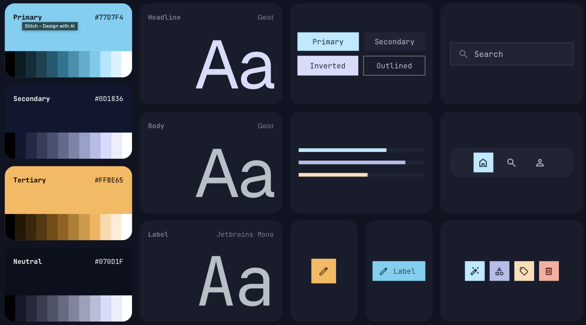

---
name: Midnight Synthetic
colors:
  surface: '#0c1325'
  surface-dim: '#0c1325'
  surface-bright: '#33384c'
  surface-container-lowest: '#070d1f'
  surface-container-low: '#151b2d'
  surface-container: '#191f32'
  surface-container-high: '#23293d'
  surface-container-highest: '#2e3448'
  on-surface: '#dce1fb'
  on-surface-variant: '#bdc8cd'
  inverse-surface: '#dce1fb'
  inverse-on-surface: '#2a3043'
  outline: '#889297'
  outline-variant: '#3e484c'
  surface-tint: '#73d3f0'
  primary: '#bdeeff'
  on-primary: '#003642'
  primary-container: '#77d7f4'
  on-primary-container: '#005d70'
  inverse-primary: '#00677d'
  secondary: '#bbc5ec'
  on-secondary: '#252f4e'
  secondary-container: '#3e4868'
  on-secondary-container: '#adb7dd'
  tertiary: '#ffe1c0'
  on-tertiary: '#462b00'
  tertiary-container: '#ffbe65'
  on-tertiary-container: '#764c00'
  error: '#ffb4ab'
  on-error: '#690005'
  error-container: '#93000a'
  on-error-container: '#ffdad6'
  primary-fixed: '#b2ebff'
  primary-fixed-dim: '#73d3f0'
  on-primary-fixed: '#001f27'
  on-primary-fixed-variant: '#004e5e'
  secondary-fixed: '#dbe1ff'
  secondary-fixed-dim: '#bbc5ec'
  on-secondary-fixed: '#0f1a38'
  on-secondary-fixed-variant: '#3c4666'
  tertiary-fixed: '#ffddb5'
  tertiary-fixed-dim: '#fbba62'
  on-tertiary-fixed: '#2a1800'
  on-tertiary-fixed-variant: '#643f00'
  background: '#0c1325'
  on-background: '#dce1fb'
  surface-variant: '#2e3448'
typography:
  headline-lg:
    fontFamily: Geist
    fontSize: 40px
    fontWeight: '700'
    lineHeight: '1.2'
    letterSpacing: -0.02em
  headline-lg-mobile:
    fontFamily: Geist
    fontSize: 30px
    fontWeight: '700'
    lineHeight: '1.2'
  headline-md:
    fontFamily: Geist
    fontSize: 24px
    fontWeight: '600'
    lineHeight: '1.3'
  body-lg:
    fontFamily: Geist
    fontSize: 18px
    fontWeight: '400'
    lineHeight: '1.6'
  body-md:
    fontFamily: Geist
    fontSize: 16px
    fontWeight: '400'
    lineHeight: '1.6'
  code-sm:
    fontFamily: JetBrains Mono
    fontSize: 14px
    fontWeight: '400'
    lineHeight: '1.5'
  label-caps:
    fontFamily: JetBrains Mono
    fontSize: 12px
    fontWeight: '600'
    lineHeight: '1'
    letterSpacing: 0.05em
rounded:
  sm: 0.125rem
  DEFAULT: 0.25rem
  md: 0.375rem
  lg: 0.5rem
  xl: 0.75rem
  full: 9999px
spacing:
  base: 8px
  container-max: 1200px
  gutter: 24px
  margin-mobile: 16px
  margin-desktop: 48px
---

## Brand & Style

The design system adopts a **Modern Tech** aesthetic with a focus on high-contrast utility and developer-centric precision. It targets technical audiences—engineers, data scientists, and power users—who require long-term legibility and reduced eye strain in low-light environments.

The visual style leverages **Minimalism** with subtle **Glassmorphism** to create a sense of depth without clutter. The palette is intentionally restricted to evoke a disciplined, professional, and futuristic atmosphere. High-vibrancy accents are used sparingly to guide the eye toward primary actions and critical information.

## Colors

The palette is anchored by a near-black midnight slate (`#070D1F`) which serves as the primary canvas. This base provides the foundation for extreme contrast and depth.

- **Primary:** High-vibrancy Cyan (`#77D7F4`) is used exclusively for interactive elements, highlights, and status indicators.
- **Surface Layering:** The secondary color (`#0D1836`) acts as a subtle step-up for containers, while code blocks utilize a specific tint (`#0D152B`) to distinguish technical content from standard body text.
- **Typography:** Pure whites and light ice-blues are used to ensure crispness against the deep background, maintaining AA/AAA accessibility standards for readability.

## Typography

This design system utilizes **Geist** for its structural and body text to achieve a minimal, technical feel. **JetBrains Mono** is employed for code blocks and utility labels to emphasize the developer-friendly nature of the interface.

To maintain high readability on dark surfaces, tracking is slightly increased for smaller labels, while large headlines feature tighter letter-spacing for a modern, impactful look. Ensure all text blocks maintain a line height of at least 1.5x for body copy to prevent visual crowding in high-contrast environments.

## Layout & Spacing

The layout follows a **Fluid Grid** philosophy using an 8px base unit. 

- **Desktop:** 12-column grid with 24px gutters. Margin is fixed at 48px or auto-centered with a max-width of 1200px.
- **Tablet:** 8-column grid with 20px gutters. 
- **Mobile:** 4-column grid with 16px gutters and 16px side margins.

Content density should remain moderately high, but significant vertical breathing room (64px+) should separate major sections to allow the high-contrast elements to stand out without overwhelming the user.

## Elevation & Depth

Depth is established through **Tonal Layers** and **Low-Contrast Outlines**. Because the background is near-black, traditional shadows are largely invisible. Instead:

1.  **Level 0 (Base):** Primary midnight slate (`#070D1F`).
2.  **Level 1 (Cards/Sidebar):** Slightly lighter navy-slate (`#0D1836`) with a 1px border of `rgba(255, 255, 255, 0.05)`.
3.  **Level 2 (Modals/Popovers):** Elevated surface with a subtle `rgba(119, 215, 244, 0.1)` (Cyan) outer glow rather than a black shadow.

Code blocks use a distinct inset appearance, achieved by a slightly lighter background and no border, creating a "carved-in" look within the UI.

## Shapes

The design system uses a **Soft** shape language. Sharp corners are avoided to prevent the UI from feeling too aggressive, but large radii are also avoided to maintain a professional, systematic tone.

- **Small elements (Buttons, Inputs):** 4px (0.25rem).
- **Medium elements (Cards, Code Blocks):** 8px (0.5rem).
- **Large elements (Modals):** 12px (0.75rem).

## Components

### Buttons
- **Primary:** Solid Cyan (`#77D7F4`) with Black (`#070D1F`) text. High impact.
- **Secondary:** Transparent background with a 1px Cyan border. Cyan text.
- **Ghost:** No background or border. Cyan or white text depending on hierarchy.

### Input Fields
Inputs use the Level 1 surface (`#0D1836`) with a subtle 1px border. On focus, the border transitions to Primary Cyan with a soft glow effect. Label text is always pinned above the field in a mono font.

### Code Blocks
Code blocks must use the dedicated surface (`#0D152B`). Syntax highlighting should use high-saturation colors (Pink, Lime, Orange) to ensure they pop against the dark blue-gray background.

### Cards
Cards are used to group related information. They should not use heavy shadows; instead, use the Level 1 surface color and a very thin, low-opacity white stroke to define the boundary.

### Chips & Badges
Chips are used for tagging and status. They should utilize a low-opacity Cyan background with a solid Cyan text label to maintain the monochromatic tech theme while indicating interactivity.