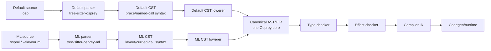
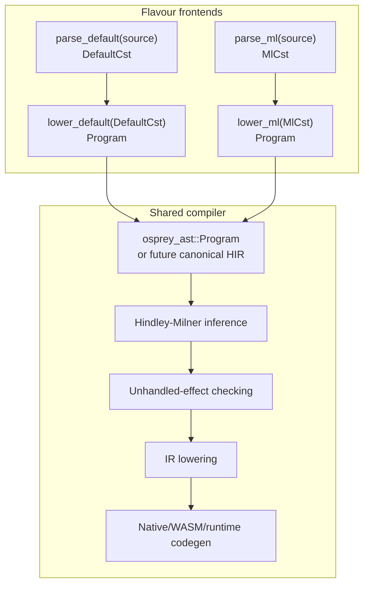
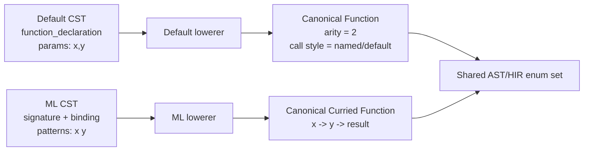
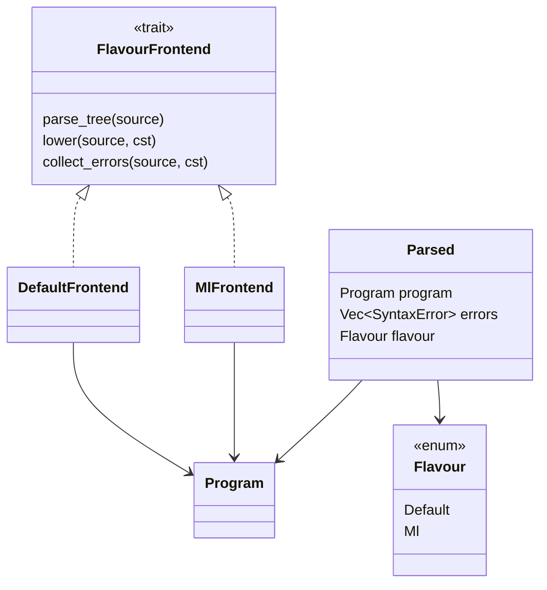
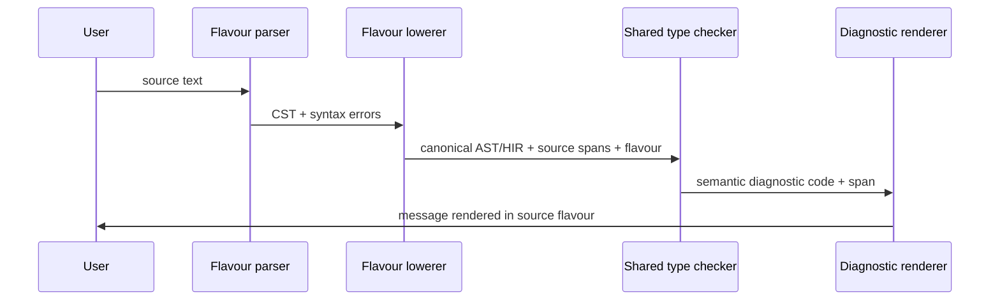
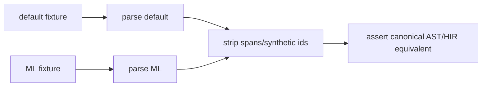

# Osprey Language Flavours

This is a design note, not a spec and not an implementation plan.

The idea is to support more than one source syntax for Osprey while keeping one
language core. The default flavour stays close to today's Osprey syntax. The ML
flavour offers the layout-based syntax explored in
[ML Syntax Prototype](ml-syntax-prototype.md).

The important constraint is that flavours must converge before type checking and
code generation. A flavour is a parser/lowering profile, not a separate
compiler. After parsing, both flavours should produce the same canonical AST or
HIR shapes and then use the same type checker, effect checker, optimizer, and
backend.

```text
default source ── parse/lower default ┐
                                      ├── canonical AST/HIR ── typecheck ── IR ── codegen
ML source      ── parse/lower ML ─────┘
```

## Multiple Parsers, One AST

Each flavour can have its own concrete syntax tree (CST). The CST is allowed to
look completely different because it represents source spelling, not language
meaning. The compiler boundary is the lowering step: every flavour-specific CST
must lower into the same canonical AST/HIR before semantic analysis begins.



The rule is strict: no type checker, effect checker, or codegen path should
inspect the original flavour. If a later compiler phase needs to ask "was this
default syntax or ML syntax?", the boundary has leaked.

The current compiler already has the right rough shape for this. Today,
`crates/osprey-syntax` parses a tree-sitter CST and lowers it into
`osprey_ast::Program`. A flavour-aware frontend would generalize that into:

```text
source -> selected parser -> flavour CST -> flavour lowerer -> Program/HIR
```

That means adding new frontend pieces, not duplicating the compiler.



### CSTs Are Disposable

The CST should be treated as parser-owned detail. It is useful for diagnostics,
formatting, highlighting, and source spans, but it should not become the semantic
model of the language.

Default CST example:

```osp
fn add(x: int, y: int) -> int = x + y
let sum = add(x: 1, y: 2)
```

ML CST example:

```osp
add : int -> int -> int
add x y = x + y
sum = add 1 2
```

Those CSTs will have different node shapes. That is fine. The lowerers decide
whether they represent the same canonical thing or different canonical things.



This diagram is intentionally not pretending the two forms are always identical.
Default `fn add(x, y)` and ML `add x y` can lower to different canonical function
shapes because they have different currying defaults. They still share one AST
vocabulary and one type checker.

### Lowering Contract

Every flavour lowerer must obey the same contract:

- Produce canonical AST/HIR only.
- Preserve source spans from the original CST.
- Preserve documentation comments.
- Preserve parameter names where they exist.
- Mark generated wrapper nodes as synthetic.
- Normalize syntax-only differences.
- Refuse flavour-only semantic hacks.

Examples of syntax-only normalization:

| Default CST | ML CST | Canonical AST/HIR |
| --- | --- | --- |
| `let x = value` | `x = value` | immutable binding |
| `x = value` assignment | `x := value` | mutation |
| `match x { A => b }` | `match x` layout arms | match expression |
| `Success { value }` | `Success value` | constructor pattern with one payload |
| `Thing { a: x }` | `Thing` layout fields | record construction |
| `op: fn(T) -> U` | `op : T => U` | effect operation payload/result |

Examples that are not syntax-only:

| Default source | ML source | Canonical result |
| --- | --- | --- |
| `fn add(x, y) = ...` | `add x y = ...` | different function shape unless explicitly normalized by wrapper generation |
| `add(x: 1, y: 2)` | `add 1 2` | same only if target callable shape matches |
| `fn add(x) -> (int) -> int = ...` | `add : int -> int -> int` | same curried function shape |

### Suggested Rust Shape

The implementation does not need two compilers. It needs a small flavour
frontend abstraction.

```rust
pub enum Flavour {
    Default,
    Ml,
}

pub struct Parsed {
    pub program: Program,
    pub errors: Vec<SyntaxError>,
    pub flavour: Flavour,
}

pub trait FlavourFrontend {
    type Cst;

    fn parse_tree(source: &str) -> Option<Self::Cst>;
    fn lower(source: &str, cst: &Self::Cst) -> Program;
    fn collect_errors(source: &str, cst: &Self::Cst) -> Vec<SyntaxError>;
}
```

Public entry point:

```rust
pub fn parse_program_with_flavour(source: &str, flavour: Flavour) -> Parsed {
    match flavour {
        Flavour::Default => default_frontend::parse_program(source),
        Flavour::Ml => ml_frontend::parse_program(source),
    }
}
```

Existing callers can keep using:

```rust
pub fn parse_program(source: &str) -> Parsed {
    parse_program_with_flavour(source, Flavour::Default)
}
```

That preserves the default syntax as the default API while allowing the ML
frontend to land behind a flag.



### Diagnostics And Source Maps

The canonical AST/HIR should carry source spans plus flavour metadata at the
file/module boundary. Semantic diagnostics should not need flavour-specific
logic, but rendering diagnostics should use the original spelling.

Example:

- Default flavour mutation fix: "use `mut` before the binding" or "assignment
  requires a mutable binding".
- ML flavour mutation fix: "use `:=` to mutate an existing `mut` binding".

The semantic error is the same. The suggested fix is flavour-specific.



### Golden Tests

A flavour system needs cross-flavour equivalence tests. For source pairs that
should mean the same thing, tests should parse both and compare canonical output.



Not every pair should be equivalent. Currying tests need two buckets:

- Equivalent: default explicit curried function versus ML curried function.
- Not equivalent: default ordinary multi-parameter function versus ML curried
  function.


## Feasibility

This is feasible, but only if the boundary is kept sharp.

Good flavour differences:

- Braces versus layout.
- `let x = ...` versus `x = ...`.
- `x = ...` mutation versus `x := ...` mutation.
- Default function declarations versus ML binding heads.
- Default call syntax versus ML whitespace application.
- Default effect declarations versus ML operation signatures.
- Default handlers with braces/`in` versus ML handler values with `do`.
- Record construction punctuation.
- Pattern sugar such as `Success { value }` versus `Success value`.

Dangerous flavour differences:

- Different type meanings after lowering.
- Different effect safety rules.
- Different runtime handler behavior.
- Different module ABI.
- Different standard library semantics.

The rule should be: syntax may differ, semantics should not.

## Currying Split

Currying is the main place where the flavours need a clear story.

The default flavour has currying, but it is not the default way to write normal
multi-argument functions. Today's style remains the common path:

```osp
fn add(x: int, y: int) -> int = x + y

let result = add(x: 1, y: 2)
```

That is an ordinary two-parameter function.

When default-flavour code wants a curried function, it writes the function value
explicitly:

```osp
fn addCurried(x: int) -> (int) -> int =
    fn(y: int) => x + y

let addOne = addCurried(1)
let answer = addOne(41)
```

The ML flavour makes the curried form the normal surface syntax:

```osp
add : int -> int -> int
add x y = x + y

addOne = add 1
answer = addOne 41
```

Both forms can lower to the same canonical representation: a function that takes
one `int` and returns a function that takes one `int`.

So the split is not "default has no currying". The split is:

- Default flavour: currying is explicit through function-returning-function
  values.
- ML flavour: currying is the default reading of multi-argument function syntax.

That keeps default Osprey approachable for C#/Rust/Go users while allowing ML
users to write idiomatic partial application.

## Currying Contrast Programs

These two programs do the same work. They build path strings by fixing one
argument at a time.

The important difference is the function signature.

In default flavour, this is an ordinary three-parameter function:

```osp
fn join3(a: string, b: string, c: string) -> string =
    a + b + c
```

It is not partially applicable. It is called as a normal function:

```osp
let direct = join3(a: "/", b: "api", c: "/tasks")
```

If default-flavour code wants currying, it says so explicitly by returning
functions:

```osp
fn join3Curried(a: string) -> (string) -> (string) -> string =
    fn(b: string) => fn(c: string) => a + b + c
```

Complete default-flavour program:

```osp
fn join3(a: string, b: string, c: string) -> string =
    a + b + c

fn join3Curried(a: string) -> (string) -> (string) -> string =
    fn(b: string) => fn(c: string) => a + b + c

fn main() -> int {
    let direct = join3(a: "/", b: "api", c: "/tasks")

    // join3("/") is not valid here. join3 is an ordinary three-parameter
    // function, so partial application is not the default.
    let withSlash = join3Curried("/")
    let underApi = withSlash("api")
    let tasksPath = underApi("/tasks")

    print(direct)
    print(tasksPath)
    0
}
```

In ML flavour, the curried signature is the normal signature:

```osp
join3 : string -> string -> string -> string
join3 a b c =
    a + b + c
```

That type means:

```osp
string -> (string -> (string -> string))
```

So every shorter call returns another function:

```osp
withSlash = join3 "/"
underApi = withSlash "api"
tasksPath = underApi "/tasks"
```

Complete ML-flavour program:

```osp
join3 : string -> string -> string -> string
join3 a b c =
    a + b + c

main : Unit -> int
main () =
    direct = join3 "/" "api" "/tasks"

    withSlash = join3 "/"
    underApi = withSlash "api"
    tasksPath = underApi "/tasks"

    print direct
    print tasksPath
    0
```

The default program has two separate functions because the ordinary
multi-parameter function and the curried function are different surface forms.
The ML program has one function because currying is the default interpretation
of the arrow chain.

## Flavour Selection

Possible selection mechanisms:

```sh
osprey app.osp --flavour default
osprey app.osp --flavour ml
```

Optional file-level marker:

```osp
// osprey: flavour=ml
```

Possible extension convention:

```text
.osp    default flavour unless overridden
.ospml  ML flavour
```

Recommended precedence:

1. CLI flag.
2. File-level marker.
3. Extension.
4. Project config.
5. Default flavour.

The compiler should store the selected flavour in diagnostics and source maps so
errors can be phrased in the syntax the author wrote.

## Canonical Lowering

The flavour frontend should lower source syntax into canonical constructs.

Examples:

| Source concept | Default flavour | ML flavour | Canonical meaning |
| --- | --- | --- | --- |
| Immutable binding | `let x = expr` | `x = expr` | bind immutable local |
| Mutable binding | `mut x = expr` | `mut x = expr` | bind mutable local |
| Mutation | `x = expr` | `x := expr` | assign mutable local |
| Ordinary function | `fn f(x, y) = body` | `f x y = body` | function binding |
| Explicit curried function | `fn f(x) -> (T) -> U = fn(y) => body` | `f x y = body` | nested function values |
| Default call | `f(x: a, y: b)` | `f a b` | call expression |
| Effect op | `op: fn(T) -> U` | `op : T => U` | effect operation payload/result |
| Handler value | `handler E { op x => body }` | `handler E ...` | handler expression |
| Install handlers | `handle h1 h2 in { body }` | `handle h1 h2 do body` | scoped handler installation |

Some rows are deliberately not one-to-one. In default flavour, `fn f(x, y)` is
an ordinary two-parameter function, while in ML flavour `f x y` should normally
mean a curried function. The canonical AST/HIR must be able to represent both.

The backend can still optimize both cases to efficient machine code. Fully
saturated curried calls can be compiled like direct multi-argument calls when
the target is known.

## Default Flavour Example

This example uses today's syntax as the common path, while still showing
explicit currying through a function that returns a function.

```osp
effect Store {
    put: fn(string) -> int
}

effect Log {
    info: fn(string) -> Unit
}

fn prefixer(prefix: string) -> (string) -> string =
    fn(value: string) => "${prefix}${value}"

fn saveTask(task: string) -> int ![Store, Log] = {
    let label = prefixer("task: ")
    let item = label(task)
    let id = perform Store.put(item)
    perform Log.info("saved #${toString(id)}")
    id
}

fn main() -> int {
    mut saved = ""
    mut logLine = ""

    let store = handler Store {
        put item => {
            saved = item
            1
        }
    }

    let log = handler Log {
        info message => {
            logLine = message
        }
    }

    handle store log in {
        let id = saveTask("buy milk")
        print("${saved} / ${logLine}")
        id
    }
}
```

Notes:

- `prefixer` is curried, but only because it explicitly returns a function.
- Ordinary calls keep parentheses.
- Multi-argument default calls can keep named arguments.
- Handler values are available in default flavour too, but with brace syntax.

## ML Flavour Example

This is the same program in ML flavour.

```osp
effect Store
    put : string => int

effect Log
    info : string => Unit

prefixer : string -> string -> string
prefixer prefix value =
    "${prefix}${value}"

saveTask : string -> int ![Store, Log]
saveTask task =
    label = prefixer "task: "
    item = label task
    id = perform Store.put item
    perform Log.info "saved #${toString id}"
    id

main : Unit -> int
main () =
    mut saved = ""
    mut logLine = ""

    store =
        handler Store
            put item =>
                saved := item
                1

    log =
        handler Log
            info message =>
                logLine := message

    handle store log
    do
        id = saveTask "buy milk"
        print "${saved} / ${logLine}"
        id
```

Notes:

- `prefixer : string -> string -> string` is curried by default.
- `prefixer "task: "` returns a function.
- `label task` applies that function.
- `:=` makes mutation visually explicit.
- Effect operations use `=>` so `->` remains function/currying syntax.

## Interop Between Flavours

Modules written in different flavours should be able to import each other.

Requirements:

- Public declarations lower to canonical signatures with parameter names and
  parameter order preserved.
- Default callers can use names when calling a function exported by ML flavour,
  if the exported declaration has stable parameter names.
- ML callers can use positional/curried application when calling a function
  exported by default flavour, if a curried wrapper is generated or the function
  is exposed as curried in metadata.
- Handler values, records, unions, effects, and results have the same canonical
  type identity regardless of source flavour.

This needs a deliberate ABI rule. The easiest conservative rule is:

- Default multi-parameter functions export as ordinary multi-parameter
  functions.
- ML curried functions export as curried function values.
- If cross-flavour convenience is desired, the compiler may generate wrapper
  functions, but the canonical declaration should remain honest.

That avoids pretending that all multi-parameter functions and all curried
functions are the same thing.

## Tooling Impact

Flavours keep the backend stable, but they do not make tooling free.

Work needed:

- Parser selection by flavour.
- Lowering from each flavour to canonical AST/HIR.
- Flavour-aware diagnostics.
- Tree-sitter grammar support for both syntaxes or separate grammars.
- VS Code syntax highlighting for both flavours.
- Formatter per flavour.
- LSP hover/completion/signature help using the authoring flavour.
- Docs examples tagged by flavour.
- Test corpus for both flavour frontends.

## Risks

The main risk is accidental language fork.

Avoid this by enforcing these rules:

- One type checker.
- One effect checker.
- One runtime semantics.
- One backend IR.
- One standard library.
- Flavour-specific syntax lowers before semantic analysis.
- Any feature that cannot lower cleanly must be a real shared language feature,
  not a flavour-only trick.

Currying is the example to watch. Default flavour can express curried function
values explicitly. ML flavour can make curried syntax pleasant. But once lowered,
both must use the same function-value semantics.

## Open Questions

- Should the compiler support mixed-flavour projects immediately, or only one
  flavour per compilation unit at first?
- Should ML files use a distinct extension, a pragma, or only a CLI flag?
- Should default flavour get brace-style first-class handler values exactly as
  shown here?
- Should ML flavour be allowed to call default multi-parameter functions with
  whitespace application, or should that require generated curried wrappers?
- Should the formatter be able to convert between flavours, or only format
  within the selected flavour?
