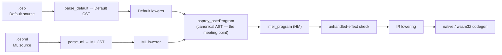
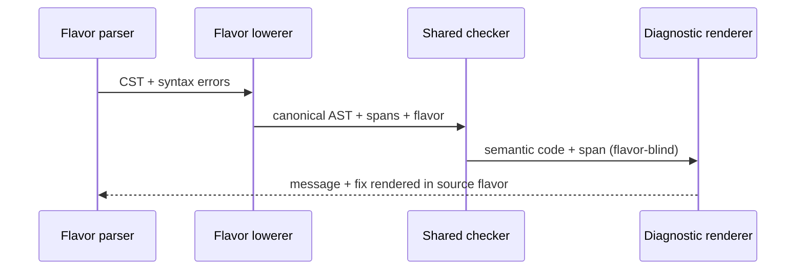
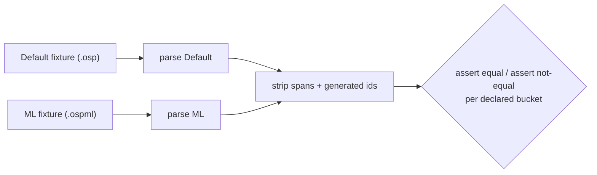

# Language Flavors

Osprey supports more than one **source syntax** over **one language core**. A
*flavor* is a parser-and-lowering profile, not a separate language: every
flavor converges on the same canonical AST before any semantic analysis runs.

This chapter is the authoritative contract for that boundary. The concrete ML
surface syntax is specified in [ML Flavor Syntax](0024-MLFlavorSyntax.md); the
implementation work is tracked in
[plan 0013](../plans/0013-ml-flavor-frontend.md).

- [The One Law](#the-one-law-flavor-boundary)
- [Flavors That Exist](#flavors-that-exist)
- [The Pipeline](#the-pipeline)
- [Flavor Frontend](#flavor-frontend)
- [Flavor Selection](#flavor-selection)
- [The Lowering Contract](#the-lowering-contract)
- [Flavor Concern vs Shared-Core Concern](#flavor-concern-vs-shared-core-concern)
- [Currying Canonicalisation](#currying-canonicalisation)
- [Shared-Core Additions](#shared-core-additions)
- [Cross-Flavor Interop](#cross-flavor-interop)
- [Flavor-Aware Diagnostics](#flavor-aware-diagnostics)
- [Cross-Flavor Equivalence Tests](#cross-flavor-equivalence-tests)
- [Resolved Open Questions](#resolved-open-questions)

## Status

The **Default flavor** is fully implemented — it is the language defined by
specs `0001`–`0022`. Today there is exactly one frontend:
[`parse_program`](../../crates/osprey-syntax/src/lib.rs) (`crates/osprey-syntax/src/lib.rs:37`)
parses a tree-sitter CST and lowers it through
[`Lowerer`](../../crates/osprey-syntax/src/lower.rs) into
`osprey_ast::Program`. There is **no** flavor abstraction yet, and no string
`"flavor"` appears anywhere in the compiler.

The **ML flavor** is planned, not implemented. The architecture below describes
the target; [plan 0013](../plans/0013-ml-flavor-frontend.md) sequences the work.
The decisive fact that makes the whole scheme cheap is already true: the type
checker ([`check_program`](../../crates/osprey-types/src/check.rs),
`crates/osprey-types/src/check.rs:480`) and code generator
([`compile_program`](../../crates/osprey-codegen/src/lower.rs),
`crates/osprey-codegen/src/lower.rs:20`) consume **only** `osprey_ast::Program`
and the inferred type tables. Neither imports `osprey_syntax` or `tree_sitter`.
Adding a flavor is adding a frontend, not a compiler.

## The One Law

`[FLAVOR-BOUNDARY]` **Everything below the canonical AST is a flavor concern.
Everything at or above the canonical AST is a shared-core concern.** The CST —
the concrete spelling of the program — belongs to the flavor. The AST belongs
to the language. The two flavors *meet* at `osprey_ast::Program` and are
indistinguishable from there on.

The rule is strict and one-directional:

> No type checker, effect checker, optimiser, IR lowering, or codegen path may
> inspect which flavor produced a program. If any phase after lowering needs to
> ask *"was this Default syntax or ML syntax?"*, the boundary has leaked and the
> design is wrong.

The only place flavor identity survives past lowering is **diagnostic
rendering** (see [Flavor-Aware Diagnostics](#flavor-aware-diagnostics)): the
*semantic* error is flavor-blind; only the *suggested fix wording* is rendered
in the author's syntax.

This is not "braces are optional" and not "the formatter picks a style." Each
flavor is a complete, self-consistent surface with its own CST node shapes.
They are reconciled by their lowerers, never by a shared grammar.

## Flavors That Exist

| Flavor | Spelling | Blocks | Calls | Currying default | Extension | Spec |
| --- | --- | --- | --- | --- | --- | --- |
| **Default** | C-style | `{ … }` braces | `f(x: a, y: b)` parens + named args | **Off** — explicit only, via function-returning-function values | `.osp` | `0001`–`0022` |
| **ML** | layout | offside-rule indentation | `f a b` whitespace application | **On** — multi-argument syntax reads as curried | `.ospml` | [0024](0024-MLFlavorSyntax.md) |

Both flavors are permanent and first-class. The Default flavor is **not**
deprecated and is **not** a transitional dialect. Earlier design drafts proposed
replacing braces with one canonical layout form; that direction is
**superseded** by this spec. Osprey keeps both surfaces and unifies them at the
AST.

## The Pipeline

```text
Default source (.osp)   ── parse default ──▶ Default CST ┐
                                                         ├─ lower ─▶ osprey_ast::Program ─▶ infer ─▶ effect-check ─▶ IR ─▶ codegen
ML source (.ospml)      ── parse ML ───────▶ ML CST ─────┘                 (one shared core, flavor-blind)
```



## Flavor Frontend

`[FLAVOR-FRONTEND]` A flavor is a small frontend object. It owns a parser (its
own CST) and a lowerer (CST → canonical AST), and nothing else. The public entry
point dispatches by flavor; the existing `parse_program` becomes the Default
specialisation so every current caller is unaffected.

```rust
// crates/osprey-syntax/src/lib.rs
pub enum Flavor {
    Default,
    Ml,
}

pub struct Parsed {
    pub program: Program,          // canonical AST — identical type for every flavor
    pub errors: Vec<SyntaxError>,
    pub flavor: Flavor,          // carried for diagnostic rendering only
}

pub trait FlavorFrontend {
    type Cst;
    fn parse_tree(source: &str) -> Option<Self::Cst>;
    fn lower(source: &str, cst: &Self::Cst) -> Program;
    fn collect_errors(source: &str, cst: &Self::Cst) -> Vec<SyntaxError>;
}

pub fn parse_program_with_flavor(source: &str, flavor: Flavor) -> Parsed {
    match flavor {
        Flavor::Default => default_frontend::parse_program(source),
        Flavor::Ml => ml_frontend::parse_program(source),
    }
}

/// Unchanged signature — Default stays the default API.
pub fn parse_program(source: &str) -> Parsed {
    parse_program_with_flavor(source, Flavor::Default)
}
```

The seam is exactly `parse_program` (`crates/osprey-syntax/src/lib.rs:37`).
Lowering (`crates/osprey-syntax/src/lower.rs`,
`crates/osprey-syntax/src/expr.rs`) already consumes generic CST nodes by
`kind()` and field name; the ML frontend adds a *parallel* parser and lowerer,
it does not touch the Default one. String-interpolation re-entry
(`expr.rs` `parse_fragment`, which recurses into `parse_program`) must thread the
active flavor through the recursion.

## Flavor Selection

`[FLAVOR-SELECT]` The compilation unit's flavor is resolved once, before
parsing, by this precedence (first match wins):

1. **CLI flag** — `osprey app.osp --flavor ml` (or `--flavor default`).
2. **File-level marker** — a leading line comment `// osprey: flavor=ml`
   (parsed like the existing `// @link:` directives,
   `crates/osprey-cli/src/main.rs:521`).
3. **Extension** — `.ospml` ⇒ ML, `.osp` ⇒ Default.
4. **Project config** — an `osprey.toml` `flavor = "…"` key (when present).
5. **Default flavor.**

Selection is resolved in the CLI (`parse_args`/`run`,
`crates/osprey-cli/src/main.rs:119`/`:200`), stored on `Cli`, and passed to
`parse_program_with_flavor`. The LSP resolves the same precedence per open
document. A file whose extension and marker disagree is a hard error, not a
silent guess.

**One flavor per compilation unit.** A single `.osp`/`.ospml` file is wholly one
flavor. Cross-flavor *projects* are supported through normal imports (see
[Cross-Flavor Interop](#cross-flavor-interop)); cross-flavor *files* are not.

## The Lowering Contract

`[FLAVOR-LOWER-CONTRACT]` Every flavor lowerer must:

- **Produce canonical AST only.** The output type is `osprey_ast::Program`. A
  lowerer may never invent a node shape that a later phase has to special-case.
- **Preserve source spans.** Generated (desugared) nodes carry the
  `Position` of the source construct they came from, so diagnostics point at real
  text. Nodes with no source span use `position: None`.
- **Preserve documentation comments** (`doc` fields) and **parameter names**.
- **Normalise syntax-only differences** (see the table below) so equivalent
  programs in different flavors produce structurally identical ASTs.
- **Refuse flavor-only semantic hacks.** If a surface construct cannot lower to
  an existing canonical node, the missing capability is a **shared-core language
  feature** (added to the AST and exposed to *both* flavors), never a node that
  only one flavor emits. See [Shared-Core Additions](#shared-core-additions).

## Flavor Concern vs Shared-Core Concern

`[FLAVOR-LAYER]` This is the heart of the contract: the exact line between what
a flavor normalises away and what the shared core defines. Every Default and ML
construct in the left two columns lowers to the **same** canonical AST node
(grounded in `crates/osprey-ast/src/lib.rs`).

| Concept | Default flavor | ML flavor | Canonical AST node |
| --- | --- | --- | --- |
| Immutable binding | `let x = e` | `x = e` | `Stmt::Let { mutable: false }` |
| Mutable binding | `mut x = e` | `mut x = e` | `Stmt::Let { mutable: true }` |
| Mutation | `x = e` | `x := e` | `Stmt::Assignment` |
| Ordinary function | `fn f(x, y) = e` | `f x y = e`† | `Stmt::Function` / curried `Lambda` chain† |
| Lambda | `fn(y) => e` | `\y => e` | `Expr::Lambda` |
| Call | `f(x: a, y: b)` | `f a b` | `Expr::Call` (`named_arguments` vs nested single-arg `Call`) |
| Block | `{ s; …; e }` | layout block | `Expr::Block { statements, value }` |
| Match | `match v { P => e }` | `match v` + indented arms | `Expr::Match` + `MatchArm` |
| One-field pattern | `Success { value }` | `Success value` | `Pattern::Constructor { fields: ["value"] }` |
| Record construction | `T { f: v }` | `T` + indented `f = v` | `Expr::TypeConstructor` |
| Record update | `r { f: v }` | layout update | `Expr::Update` |
| Effect declaration | `effect E { op: fn(T)->U }` | `effect E` + `op : T => U` | `Stmt::Effect` + `EffectOperation` |
| Perform | `perform E.op(a)` | `perform E.op a` | `Expr::Perform` |

† See [Currying Canonicalisation](#currying-canonicalisation): Default
`fn f(x, y)` is one two-parameter function; ML `f x y` is a curried chain. They
share the AST *vocabulary* but are deliberately **not** the same value.

Anything in that table is a **flavor concern**: the lowerer erases the spelling
difference and nothing downstream can tell which surface was used. Constructs
that have *no* row — because the canonical AST cannot yet express them — are
**shared-core concerns** and are handled in the next two sections.

## Currying Canonicalisation

`[FLAVOR-CURRY]` Currying is the one place the flavors read differently, and it
is still pure lowering — **no type-checker or codegen change is required.**

The canonical type `Type::Fun { params: Vec<Type>, ret: Box<Type> }`
(`crates/osprey-types/src/ty.rs:67`) is flat multi-arity. A *curried* function is
simply a **nested** `Fun`: `int -> int -> int` is
`Fun{[int], Fun{[int], int}}`. A curried *definition* is a chain of one-parameter
`Expr::Lambda` values; a curried *application* is nested one-argument
`Expr::Call`s. All three node forms already exist and already work
(capture-carrying lambdas-as-values are implemented — see
[plan 0002](../plans/0002-codegen-generic-function-values.md)).

So the split is entirely in the lowerers:

- **Default flavor: currying is explicit.** `fn add(x, y) = x + y` lowers to one
  `Stmt::Function` with two parameters. Currying happens only when the author
  writes a function that returns a function:

  ```osp
  fn addCurried(x) -> (int) -> int = fn(y) => x + y
  ```

  which lowers to a one-parameter `Function` whose body is a one-parameter
  `Lambda`.

- **ML flavor: currying is the default reading.** `add x y = e` with the
  curried signature `add : int -> int -> int` lowers to **the same nested-lambda
  shape** as the Default `addCurried` above — a one-parameter binding returning a
  one-parameter `Lambda`. ML whitespace application `add 1 2` lowers to nested
  single-argument calls `Call(Call(add, [1]), [2])`, each of which is fully
  saturated against a one-parameter `Fun`. Partial application `add 1` is just
  the inner saturated call returning a function value.

Because each ML function and each ML application is one-argument, ML currying
maps onto the existing exact-arity checker with **no** partial-application
support added to the core. The ML lowerer does the work; the core stays as-is.

**Two equivalence buckets** (used by the golden tests below):

- **Equivalent:** Default explicit-curried `addCurried` ≡ ML curried `add`.
  Identical canonical AST (modulo names and spans).
- **Not equivalent:** Default multi-parameter `fn add(x, y)` ≢ ML curried
  `add x y`. Different canonical AST — one two-parameter `Function` versus a
  one-parameter `Function` returning a `Lambda`. The test asserts they are *not*
  equal. Conflating them would be the boundary leaking.

## Shared-Core Additions

`[FLAVOR-HANDLER-VALUE]` The ML design needs one capability the canonical AST
cannot yet express, so it is added to the **shared core** and exposed in **both**
flavors — never as an ML-only node.

Today `Expr::Handler { effect, arms, body }`
(`crates/osprey-ast/src/lib.rs:451`) fuses three things — *which effect*, *the
arms*, and *the handled body* — into one expression, matching the Default
surface `handle E op => … in body`. There is **no** first-class handler value
(`Handler E` type), and installing N effects requires N nested `handle … in`
expressions. The ML design wants handler **values** that can be named, returned,
parameterised, and passed to tests, and one `handle h1 h2 do body` that installs
several at once.

That is a genuine language feature, not syntax. The shared core gains:

- **AST:** split installation from construction.
  - `Expr::HandlerValue { effect, arms }` — an expression that *evaluates to* a
    handler value of type `Handler E`.
  - `Expr::Install { handlers: Vec<Expr>, body }` — installs a list of handler
    values around a computation.
  - The existing `Expr::Handler { effect, arms, body }` becomes sugar for
    `Install { [HandlerValue { effect, arms }], body }`, so all current Default
    programs keep working unchanged.
- **Types:** a `Handler E` type constructor; coverage checking that an arm set
  satisfies the effect's operations; `handler`-owned `mut` state (already
  modelled, per [Algebraic Effects](0017-AlgebraicEffects.md)) attached to the
  value.
- **Codegen:** a runtime handler-value representation and an install-a-list
  lowering (`handle h1 h2 … in/do body` lowers to nested installs internally).

Both flavors then expose it in their own spelling:

| | Construct a handler value | Install one or more |
| --- | --- | --- |
| **Default** | `let db = handler Db { add t => … }` | `handle db log in { body }` |
| **ML** | `db = handler Db` + indented arms | `handle db log do body` |

This is the model case for the contract's last rule: a flavor may make a feature
*pleasant*, but the feature itself lives in the shared core with one semantics.
First-class handlers, `Handler E`, and multi-install are tracked as Phase 0 of
[plan 0013](../plans/0013-ml-flavor-frontend.md) — they land flavor-neutrally
**before** the ML frontend, because the ML examples depend on them.

## Cross-Flavor Interop

`[FLAVOR-INTEROP]` Modules written in different flavors import each other
normally, because exported declarations are canonical AST signatures with stable
parameter names and order. The ABI rule is deliberately honest about the
currying split:

- A **Default** multi-parameter function exports as an ordinary multi-parameter
  function. An ML caller may call it only as a **saturated** application; partial
  application of a non-curried import is a type error unless a curried wrapper is
  generated.
- An **ML** curried function exports as a curried function value. A Default caller
  applies it through ordinary function-value calls.
- Handler values, records, unions, `Result`, and effects have one canonical type
  identity regardless of source flavor.

The compiler **may** generate convenience wrappers (a curried view of a
multi-parameter export, or a saturated view of a curried export), but the
canonical declaration stays honest — the core never pretends a multi-parameter
function and a curried function are the same value.

## Flavor-Aware Diagnostics

`[FLAVOR-DIAG]` The semantic diagnostic — its code and span — is produced by the
flavor-blind checker. Only the *suggested-fix wording* is rendered in the
authoring flavor, using the `flavor` carried on `Parsed`.

| Semantic error | Default-flavor fix | ML-flavor fix |
| --- | --- | --- |
| write to an immutable binding | "declare it `mut` and assign with `=`" | "declare it `mut` and mutate with `:=`" |
| same-scope rebinding | "use a new name or `mut` + `=`" | "use `:=` if you meant to mutate" |
| unhandled effect | identical semantic message; example uses `handle … in` | identical semantic message; example uses `handle … do` |



## Cross-Flavor Equivalence Tests

`[FLAVOR-TEST]` A flavor system is only honest if equivalence is machine-checked.
For a pair of fixtures meant to mean the same thing, parse both, strip spans and
generated identifiers, and compare canonical ASTs. The harness keys flavor off
extension (`.osp` ⇒ Default, `.ospml` ⇒ ML), reusing the differential machinery
in `crates/diff_examples.sh`.

Two buckets, both asserted:

- **Equivalent** — e.g. Default explicit-curried function vs ML curried function;
  Default `handle h1 h2 in body` vs ML `handle h1 h2 do body`. Canonical ASTs must
  be equal.
- **Not equivalent** — e.g. Default multi-parameter function vs ML curried
  function. Canonical ASTs must differ.



## Resolved Open Questions

The design drafts left these open; this spec settles them.

- **Mixed-flavor projects:** allowed across files (via imports + interop ABI),
  never within a file. One flavor per compilation unit.
- **Flavor selection:** all of CLI flag, file marker, and extension are
  supported, in the precedence above. `.ospml` is the ML extension.
- **First-class brace handler values in Default:** yes. First-class handler
  values, `Handler E`, and multi-install are shared-core features; the Default
  flavor gains the brace spelling for them (a backward-compatible superset).
- **ML calling Default multi-parameter functions with whitespace application:**
  only as a saturated call; partial application requires a generated curried
  wrapper. The canonical export stays multi-parameter.
- **Formatter conversion between flavors:** the formatter formats *within* a
  flavor. A separate, optional `osprey convert` tool may transliterate one
  flavor to the other; it is not part of the formatter.

## Risks

The dominant risk is an accidental language fork. It is held off by the same six
invariants for every flavor: one type checker, one effect checker, one runtime
semantics, one backend IR, one standard library, and flavor-specific syntax
that lowers *before* semantic analysis. Currying is the canary — both flavors
must end at the same function-value semantics. Any construct that cannot lower
cleanly is promoted to a shared feature ([Shared-Core
Additions](#shared-core-additions)), never smuggled in as a flavor-only node.

## Cross-references

- [ML Flavor Syntax](0024-MLFlavorSyntax.md) — the ML surface reference.
- [Plan 0013 — ML Flavor Frontend](../plans/0013-ml-flavor-frontend.md) — the
  implementation plan and TODO checklists.
- [Syntax](0003-Syntax.md), [Algebraic Effects](0017-AlgebraicEffects.md),
  [Type System](0004-TypeSystem.md) — the Default flavor these build on.
