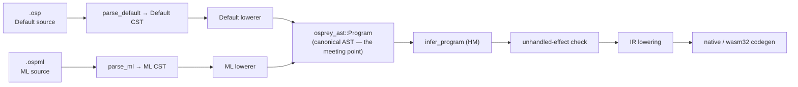
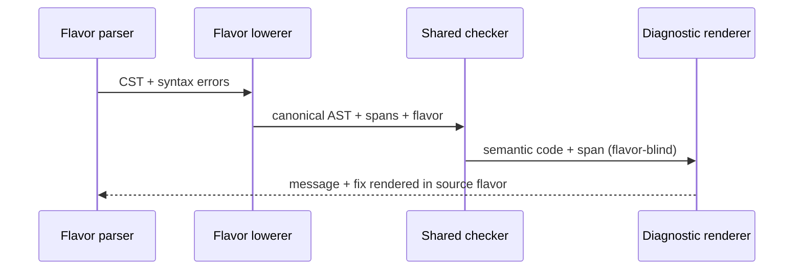
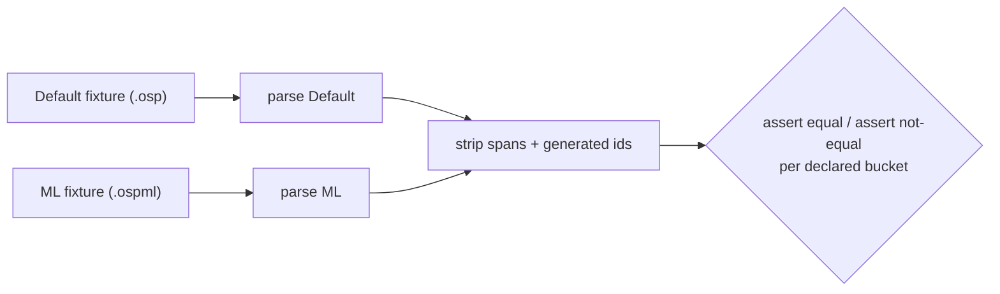

# Language Flavors

Osprey supports more than one **source syntax** over **one language core**. A
*flavor* is a parser-and-lowering profile, not a separate language: every
flavor converges on the same canonical AST before any semantic analysis runs.

This chapter is the authoritative contract for that boundary. The concrete ML
surface syntax is specified in [ML Flavor Syntax](/spec/0024-mlflavorsyntax/); the
implementation work is tracked in
[plan 0013](https://github.com/Nimblesite/osprey/blob/main/docs/plans/0013-ml-flavor-frontend.md).

- [The One Law](#the-one-law-flavor-boundary)
- [Flavors That Exist](#flavors-that-exist)
- [The Pipeline](#the-pipeline)
- [Flavor Frontend](#flavor-frontend)
- [Flavor Selection](#flavor-selection)
- [The Lowering Contract](#the-lowering-contract)
- [Flavor Concern vs Shared-Core Concern](#flavor-concern-vs-shared-core-concern)
- [Currying Canonicalisation](#currying-canonicalisation)
- [Shared-Core Additions](#shared-core-additions)
- [Cross-Flavor Interop](#cross-flavor-interop)
- [Flavor-Aware Diagnostics](#flavor-aware-diagnostics)
- [Cross-Flavor Equivalence Tests](#cross-flavor-equivalence-tests)
- [Positioning and Messaging](#positioning-and-messaging)
- [Resolved Open Questions](#resolved-open-questions)

## Status

The **Default flavor** is fully implemented — it is the language defined by
specs `0001`–`0022`. The Default frontend is
[`parse_program`](https://github.com/Nimblesite/osprey/blob/main/crates/osprey-syntax/src/lib.rs) (`crates/osprey-syntax/src/lib.rs:37`),
which parses a tree-sitter CST and lowers it through
[`Lowerer`](https://github.com/Nimblesite/osprey/blob/main/crates/osprey-syntax/src/lower.rs) into `osprey_ast::Program`.

**Implemented and green.** The flavor seam is live. **Phase 1** (flavor
frontend seam) ships the `Flavor` enum, `Parsed.flavor`, and
`parse_program_with_flavor`, with the unchanged `parse_program` kept as the
`Flavor::Default` specialisation so every existing caller is unaffected.
**Phase 4** (flavor selection) ships the CLI `--flavor default|ml` flag, the
`.ospml` extension, and the `// osprey: flavor=ml` marker, resolved by the
precedence flag > marker > extension > Default with a hard error when extension
and marker disagree. The differential harness
([`crates/diff_examples.sh`](https://github.com/Nimblesite/osprey/blob/main/crates/diff_examples.sh)) now discovers
`.ospml` fixtures **additively**, leaving every existing `.osp` example
untouched.

**Implementation decision — hand-written Rust layout frontend.** The ML
frontend (Phases 2–3) is implemented as a **hand-written Rust layout lexer +
recursive-descent (Pratt / precedence-climbing) parser** in
[`crates/osprey-syntax/src/ml/`](https://github.com/Nimblesite/osprey/blob/main/crates/osprey-syntax/src/ml/)
(`token.rs`, `lexer.rs`, `cst.rs`, `parser.rs`, `lower.rs`, `mod.rs`). The parser
produces an ML **concrete syntax tree (CST)**; a separate lowerer (`lower.rs`)
converts that CST to canonical `osprey_ast::Program` — a clean **CST→AST
separation**, symmetric with the Default flavor's tree-sitter CST → lower → AST. The lexer derives layout markers
(`Indent`/`Dedent`/`Newline`) from the **offside rule** (Landin 1966) via an
explicit indentation stack, with bracket depth suppressing layout inside
parentheses. This **supersedes** the earlier plan of a `tree-sitter-osprey-ml`
grammar with an external C scanner. Rationale: the offside rule is naturally
expressed with an explicit indent stack in safe Rust; it stays panic-free /
`Result`-returning and unit-testable (project rules), with no `unsafe` C and no
codegen-tool build dependency. Per [`[FLAVOR-BOUNDARY]`](#the-one-law) the
parser **mechanism** is a below-the-AST, flavor-internal concern, so this swap
does not change the architecture (many CSTs, one AST). The ML parser is in
active development; first-class handler values + effects (Phase 0) remain
deferred, so ML handler/effect syntax errors loudly until they land.

The decisive fact that makes the whole scheme cheap is already true: the type
checker ([`check_program`](https://github.com/Nimblesite/osprey/blob/main/crates/osprey-types/src/check.rs),
`crates/osprey-types/src/check.rs:480`) and code generator
([`compile_program`](https://github.com/Nimblesite/osprey/blob/main/crates/osprey-codegen/src/lower.rs),
`crates/osprey-codegen/src/lower.rs:20`) consume **only** `osprey_ast::Program`
and the inferred type tables. Neither imports `osprey_syntax` or `tree_sitter`.
Adding a flavor is adding a frontend, not a compiler. The parsing techniques
behind the hand-written frontend are cited in
[spec 0024 References](/spec/0024-mlflavorsyntax/#references).

## The One Law

`[FLAVOR-BOUNDARY]` **Everything below the canonical AST is a flavor concern.
Everything at or above the canonical AST is a shared-core concern.** The CST —
the concrete spelling of the program — belongs to the flavor. The AST belongs
to the language. The two flavors *meet* at `osprey_ast::Program` and are
indistinguishable from there on.

The rule is strict and one-directional:

> No type checker, effect checker, optimiser, IR lowering, or codegen path may
> inspect which flavor produced a program. If any phase after lowering needs to
> ask *"was this Default syntax or ML syntax?"*, the boundary has leaked and the
> design is wrong.

The only place flavor identity survives past lowering is **diagnostic
rendering** (see [Flavor-Aware Diagnostics](#flavor-aware-diagnostics)): the
*semantic* error is flavor-blind; only the *suggested fix wording* is rendered
in the author's syntax.

This is not "braces are optional" and not "the formatter picks a style." Each
flavor is a complete, self-consistent surface with its own CST node shapes.
They are reconciled by their lowerers, never by a shared grammar.

## Flavors That Exist

| Flavor | Spelling | Blocks | Calls | Currying default | Extension | Spec |
| --- | --- | --- | --- | --- | --- | --- |
| **Default** | C-style | `{ … }` braces | `f(x: a, y: b)` parens + named args | **Off** — explicit only, via function-returning-function values | `.osp` | `0001`–`0022` |
| **ML** | layout | offside-rule indentation | `f a b` whitespace application | **On** — multi-argument syntax reads as curried | `.ospml` | [0024](/spec/0024-mlflavorsyntax/) |

Both flavors are permanent and first-class. The Default flavor is **not**
deprecated and is **not** a transitional dialect. Earlier design drafts proposed
replacing braces with one canonical layout form; that direction is
**superseded** by this spec. Osprey keeps both surfaces and unifies them at the
AST.

## The Pipeline

```text
Default source (.osp)   ── parse default ──▶ Default CST ┐
                                                         ├─ lower ─▶ osprey_ast::Program ─▶ infer ─▶ effect-check ─▶ IR ─▶ codegen
ML source (.ospml)      ── parse ML ───────▶ ML CST ─────┘                 (one shared core, flavor-blind)
```



## Flavor Frontend

`[FLAVOR-FRONTEND]` A flavor is a small frontend object. It owns a parser (its
own CST) and a lowerer (CST → canonical AST), and nothing else. The public entry
point dispatches by flavor; the existing `parse_program` becomes the Default
specialisation so every current caller is unaffected.

```rust
// crates/osprey-syntax/src/lib.rs
pub enum Flavor {
    Default,
    Ml,
}

pub struct Parsed {
    pub program: Program,          // canonical AST — identical type for every flavor
    pub errors: Vec<SyntaxError>,
    pub flavor: Flavor,          // carried for diagnostic rendering only
}

pub trait FlavorFrontend {
    type Cst;
    fn parse_tree(source: &str) -> Option<Self::Cst>;
    fn lower(source: &str, cst: &Self::Cst) -> Program;
    fn collect_errors(source: &str, cst: &Self::Cst) -> Vec<SyntaxError>;
}

pub fn parse_program_with_flavor(source: &str, flavor: Flavor) -> Parsed {
    match flavor {
        Flavor::Default => default_frontend::parse_program(source),
        Flavor::Ml => ml_frontend::parse_program(source),
    }
}

/// Unchanged signature — Default stays the default API.
pub fn parse_program(source: &str) -> Parsed {
    parse_program_with_flavor(source, Flavor::Default)
}
```

The seam is exactly `parse_program` (`crates/osprey-syntax/src/lib.rs:37`).
Lowering (`crates/osprey-syntax/src/lower.rs`,
`crates/osprey-syntax/src/expr.rs`) already consumes generic CST nodes by
`kind()` and field name; the ML frontend adds a *parallel* parser and lowerer,
it does not touch the Default one. String-interpolation re-entry
(`expr.rs` `parse_fragment`, which recurses into `parse_program`) must thread the
active flavor through the recursion.

## Flavor Selection

`[FLAVOR-SELECT]` The compilation unit's flavor is resolved once, before
parsing, by this precedence (first match wins):

1. **CLI flag** — `osprey app.osp --flavor ml` (or `--flavor default`).
2. **File-level marker** — a leading line comment `// osprey: flavor=ml`
   (parsed like the existing `// @link:` directives,
   `crates/osprey-cli/src/main.rs:521`).
3. **Extension** — `.ospml` ⇒ ML, `.osp` ⇒ Default.
4. **Project config** — an `osprey.toml` `flavor = "…"` key (when present).
5. **Default flavor.**

The marker-and-extension precedence lives in **one** place,
`osprey_syntax::resolve_flavor(flag, path, source)`
(`crates/osprey-syntax/src/lib.rs`), so the CLI and the editor can never drift
to different frontends for the same file. The CLI layers the `--flavor` flag on
top (`parse_args`/`run`, `crates/osprey-cli/src/main.rs`) and passes the result
to `parse_program_with_flavor`. The LSP resolves the same precedence per open
document through `osprey_syntax::parse_program_for_path(uri, text)`, which every
analysis (diagnostics, symbols, hover, completion, signature help, navigation)
routes through — so a `.ospml` file is parsed by the ML frontend in the editor
exactly as on the command line, instead of being misreported as broken Default
syntax. A file whose extension and marker disagree is a hard error in the CLI; in
the editor the conflict degrades to Default (it surfaces as ordinary
diagnostics) rather than refusing to open the document.

**One flavor per compilation unit.** A single `.osp`/`.ospml` file is wholly one
flavor. Cross-flavor *projects* are supported through normal imports (see
[Cross-Flavor Interop](#cross-flavor-interop)); cross-flavor *files* are not.

## The Lowering Contract

`[FLAVOR-LOWER-CONTRACT]` Every flavor lowerer must:

- **Produce canonical AST only.** The output type is `osprey_ast::Program`. A
  lowerer may never invent a node shape that a later phase has to special-case.
- **Preserve source spans.** Generated (desugared) nodes carry the
  `Position` of the source construct they came from, so diagnostics point at real
  text. Nodes with no source span use `position: None`.
- **Preserve documentation comments** (`doc` fields) and **parameter names**.
- **Normalise syntax-only differences** (see the table below) so equivalent
  programs in different flavors produce structurally identical ASTs.
- **Refuse flavor-only semantic hacks.** If a surface construct cannot lower to
  an existing canonical node, the missing capability is a **shared-core language
  feature** (added to the AST and exposed to *both* flavors), never a node that
  only one flavor emits. See [Shared-Core Additions](#shared-core-additions).

## Flavor Concern vs Shared-Core Concern

`[FLAVOR-LAYER]` This is the heart of the contract: the exact line between what
a flavor normalises away and what the shared core defines. Every Default and ML
construct in the left two columns lowers to the **same** canonical AST node
(grounded in `crates/osprey-ast/src/lib.rs`).

| Concept | Default flavor | ML flavor | Canonical AST node |
| --- | --- | --- | --- |
| Immutable binding | `let x = e` | `x = e` | `Stmt::Let { mutable: false }` |
| Mutable binding | `mut x = e` | `mut x = e` | `Stmt::Let { mutable: true }` |
| Mutation | `x = e` | `x := e` | `Stmt::Assignment` |
| Ordinary function | `fn f(x, y) = e` | `f x y = e`† | `Stmt::Function` / curried `Lambda` chain† |
| Lambda | `fn(y) => e` | `\y => e` | `Expr::Lambda` |
| Call | `f(x: a, y: b)` | `f a b` | `Expr::Call` (`named_arguments` vs nested single-arg `Call`) |
| Block | `{ s; …; e }` | layout block | `Expr::Block { statements, value }` |
| Match | `match v { P => e }` | `match v` + indented arms | `Expr::Match` + `MatchArm` |
| One-field pattern | `Success { value }` | `Success value` | `Pattern::Constructor { fields: ["value"] }` |
| Record construction | `T { f: v }` | `T` + indented `f = v` | `Expr::TypeConstructor` |
| Record update | `r { f: v }` | layout update | `Expr::Update` |
| Effect declaration | `effect E { op: fn(T)->U }` | `effect E` + `op : T => U` | `Stmt::Effect` + `EffectOperation` |
| Perform | `perform E.op(a)` | `perform E.op a` | `Expr::Perform` |

† See [Currying Canonicalisation](#currying-canonicalisation): Default
`fn f(x, y)` is one two-parameter function; ML `f x y` is a curried chain. They
share the AST *vocabulary* but are deliberately **not** the same value.

Anything in that table is a **flavor concern**: the lowerer erases the spelling
difference and nothing downstream can tell which surface was used. Constructs
that have *no* row — because the canonical AST cannot yet express them — are
**shared-core concerns** and are handled in the next two sections.

## Currying Canonicalisation

`[FLAVOR-CURRY]` Currying is the one place the flavors read differently, and it
is still pure lowering — **no type-checker or codegen change is required.**

The canonical type `Type::Fun { params: Vec<Type>, ret: Box<Type> }`
(`crates/osprey-types/src/ty.rs:67`) is flat multi-arity. A *curried* function is
simply a **nested** `Fun`: `int -> int -> int` is
`Fun{[int], Fun{[int], int}}`. A curried *definition* is a chain of one-parameter
`Expr::Lambda` values; a curried *application* is nested one-argument
`Expr::Call`s. All three node forms already exist and already work
(capture-carrying lambdas-as-values are implemented — see
[plan 0002](https://github.com/Nimblesite/osprey/blob/main/docs/plans/0002-codegen-generic-function-values.md)).

So the split is entirely in the lowerers:

- **Default flavor: currying is explicit.** `fn add(x, y) = x + y` lowers to one
  `Stmt::Function` with two parameters. Currying happens only when the author
  writes a function that returns a function:

  ```osp
  fn addCurried(x) -> (int) -> int = fn(y) => x + y
  ```

  which lowers to a one-parameter `Function` whose body is a one-parameter
  `Lambda`.

- **ML flavor: currying is the default reading.** `add x y = e` with the
  curried signature `add : int -> int -> int` lowers to **the same nested-lambda
  shape** as the Default `addCurried` above — a one-parameter binding returning a
  one-parameter `Lambda`. ML whitespace application `add 1 2` lowers to nested
  single-argument calls `Call(Call(add, [1]), [2])`, each of which is fully
  saturated against a one-parameter `Fun`. Partial application `add 1` is just
  the inner saturated call returning a function value.

Because each ML function and each ML application is one-argument, ML currying
maps onto the existing exact-arity checker with **no** partial-application
support added to the core. The ML lowerer does the work; the core stays as-is.

**Two equivalence buckets** (used by the golden tests below):

- **Equivalent:** Default explicit-curried `addCurried` ≡ ML curried `add`.
  Identical canonical AST (modulo names and spans).
- **Not equivalent:** Default multi-parameter `fn add(x, y)` ≢ ML curried
  `add x y`. Different canonical AST — one two-parameter `Function` versus a
  one-parameter `Function` returning a `Lambda`. The test asserts they are *not*
  equal. Conflating them would be the boundary leaking.

## Shared-Core Additions

`[FLAVOR-HANDLER-VALUE]` The ML design needs one capability the canonical AST
cannot yet express, so it is added to the **shared core** and exposed in **both**
flavors — never as an ML-only node.

Today `Expr::Handler { effect, arms, body }`
(`crates/osprey-ast/src/lib.rs:451`) fuses three things — *which effect*, *the
arms*, and *the handled body* — into one expression, matching the Default
surface `handle E op => … in body`. There is **no** first-class handler value
(`Handler E` type), and installing N effects requires N nested `handle … in`
expressions. The ML design wants handler **values** that can be named, returned,
parameterised, and passed to tests, and one `handle h1 h2 do body` that installs
several at once.

That is a genuine language feature, not syntax. The shared core gains:

- **AST:** split installation from construction.
  - `Expr::HandlerValue { effect, arms }` — an expression that *evaluates to* a
    handler value of type `Handler E`.
  - `Expr::Install { handlers: Vec<Expr>, body }` — installs a list of handler
    values around a computation.
  - The existing `Expr::Handler { effect, arms, body }` becomes sugar for
    `Install { [HandlerValue { effect, arms }], body }`, so all current Default
    programs keep working unchanged.
- **Types:** a `Handler E` type constructor; coverage checking that an arm set
  satisfies the effect's operations; `handler`-owned `mut` state (already
  modelled, per [Algebraic Effects](/spec/0017-algebraiceffects/)) attached to the
  value.
- **Codegen:** a runtime handler-value representation and an install-a-list
  lowering (`handle h1 h2 … in/do body` lowers to nested installs internally).

Both flavors then expose it in their own spelling:

| | Construct a handler value | Install one or more |
| --- | --- | --- |
| **Default** | `let db = handler Db { add t => … }` | `handle db log in { body }` |
| **ML** | `db = handler Db` + indented arms | `handle db log do body` |

This is the model case for the contract's last rule: a flavor may make a feature
*pleasant*, but the feature itself lives in the shared core with one semantics.
First-class handlers, `Handler E`, and multi-install are tracked as Phase 0 of
[plan 0013](https://github.com/Nimblesite/osprey/blob/main/docs/plans/0013-ml-flavor-frontend.md) — they land flavor-neutrally
**before** the ML frontend, because the ML examples depend on them.

## Cross-Flavor Interop

`[FLAVOR-INTEROP]` Modules written in different flavors import each other
normally, because exported declarations are canonical AST signatures with stable
parameter names and order. The ABI rule is deliberately honest about the
currying split:

- A **Default** multi-parameter function exports as an ordinary multi-parameter
  function. An ML caller may call it only as a **saturated** application; partial
  application of a non-curried import is a type error unless a curried wrapper is
  generated.
- An **ML** curried function exports as a curried function value. A Default caller
  applies it through ordinary function-value calls.
- Handler values, records, unions, `Result`, and effects have one canonical type
  identity regardless of source flavor.

The compiler **may** generate convenience wrappers (a curried view of a
multi-parameter export, or a saturated view of a curried export), but the
canonical declaration stays honest — the core never pretends a multi-parameter
function and a curried function are the same value.

## Flavor-Aware Diagnostics

`[FLAVOR-DIAG]` The semantic diagnostic — its code and span — is produced by the
flavor-blind checker. Only the *suggested-fix wording* is rendered in the
authoring flavor, using the `flavor` carried on `Parsed`.

| Semantic error | Default-flavor fix | ML-flavor fix |
| --- | --- | --- |
| write to an immutable binding | "declare it `mut` and assign with `=`" | "declare it `mut` and mutate with `:=`" |
| same-scope rebinding | "use a new name or `mut` + `=`" | "use `:=` if you meant to mutate" |
| unhandled effect | identical semantic message; example uses `handle … in` | identical semantic message; example uses `handle … do` |



## Cross-Flavor Equivalence Tests

`[FLAVOR-TEST]` A flavor system is only honest if equivalence is machine-checked.
For a pair of fixtures meant to mean the same thing, parse both, strip spans and
generated identifiers, and compare canonical ASTs. The harness keys flavor off
extension (`.osp` ⇒ Default, `.ospml` ⇒ ML), reusing the differential machinery
in `crates/diff_examples.sh`.

Two buckets, both asserted:

- **Equivalent** — e.g. Default explicit-curried function vs ML curried function;
  Default `handle h1 h2 in body` vs ML `handle h1 h2 do body`. Canonical ASTs must
  be equal.
- **Not equivalent** — e.g. Default multi-parameter function vs ML curried
  function. Canonical ASTs must differ.



`[FLAVOR-IR-EQUIV]` Canonical-AST equality is necessary but not sufficient on its
own to convince a reader the backend is flavor-blind. We therefore add a
**stronger, end-to-end layer**: a Default twin (`.osp`) and its ML counterpart
(`.ospml`) must emit **byte-identical LLVM IR**. Because lowering meets at one
AST and `[FLAVOR-BOUNDARY]` forbids anything below it from inspecting the flavor,
`osprey_codegen::compile_program` is a pure function of the canonical AST — so
identical AST ⇒ identical IR text, with **no normalisation required** (verified:
the IR diff for a paired fixture is empty). This is enforced in-process (no built
binary needed) by `crates/osprey-cli/tests/cross_flavor_ir_equiv.rs`, which runs
in the `rust` CI job under `cargo test --workspace`.

**Paired-example convention.** Equivalence fixtures live as real, runnable
examples under `examples/tested/ml/`. Each concept is a triple sharing one stem:

- `<stem>.ospml` — the ML-flavor program (curry-by-default, offside layout).
- `<stem>.osp` — the Default twin, hand-written so it lowers to the *same* AST
  (explicit-curry `fn f(x) = fn(y) => …` mirrors ML `f x y = …`; call syntax
  `toString(y)` mirrors ML whitespace application `toString y`; a Default
  `fn main() = { … }` mirrors a bare ML top-level script).
- `<stem>.expectedoutput` — **one shared golden file** for both flavors. The
  differential harness (`crates/diff_examples.sh`) resolves a source's golden as
  `<file>.expectedoutput` → OS-specific → `<stem>.expectedoutput`, so a pair
  needs no duplicate golden. The IR test additionally requires every `.ospml` to
  have a `.osp` twin, so the pairing can never silently rot.

`[FLAVOR-ASSIGN]` **Declare-and-bind in one form.** ML spells a value binding
`name = expr` (no keyword); it lowers to the canonical `Let` node — the exact
node Default produces for `let name = expr`. The type is always inferred
(Hindley-Milner), so no annotation is needed or wanted. This holds identically at
module top level and inside a layout block, and the bound value's IR is
byte-identical to the Default `let`.

**Assumptions recorded by this layer.** (1) Arithmetic stays
`Result`-wrapped in *both* flavors — overflow-checked `+` yields
`Result<int, MathError>`, so a raw `y = x + 1` then `toString y` prints
`Success(42)` in ML *and* Default alike; clean `int` output comes from the usual
function-boundary auto-unwrap, not from any flavor-specific rule. (2) Effects /
first-class handlers are deferred (Phase 0, [`[FLAVOR-HANDLER-VALUE]`](#shared-core-additions));
paired fixtures use only shared-core constructs until that lands. (3) The Default
twin is authored to match the ML AST, not the other way around — ML is the
flavor under test, Default is the oracle.

## Resolved Open Questions

The design drafts left these open; this spec settles them.

- **Mixed-flavor projects:** allowed across files (via imports + interop ABI),
  never within a file. One flavor per compilation unit.
- **Flavor selection:** all of CLI flag, file marker, and extension are
  supported, in the precedence above. `.ospml` is the ML extension.
- **First-class brace handler values in Default:** yes. First-class handler
  values, `Handler E`, and multi-install are shared-core features; the Default
  flavor gains the brace spelling for them (a backward-compatible superset).
- **ML calling Default multi-parameter functions with whitespace application:**
  only as a saturated call; partial application requires a generated curried
  wrapper. The canonical export stays multi-parameter.
- **Formatter conversion between flavors:** the formatter formats *within* a
  flavor. A separate, optional `osprey convert` tool may transliterate one
  flavor to the other; it is not part of the formatter.

## Positioning and Messaging

`[FLAVOR-MESSAGING]` This section is the **authoritative source** for how the
flavor system is described to users — in the root `README.md`, the website
landing page, the VS Code extension README, `examples/README.md`, blog posts,
and any future marketing surface. Public copy must match the technical contract
above; the rules here keep the two in sync so the messaging never overstates the
implementation.

**The one-line positioning.** *One core. Two surfaces. Zero compromise.* Osprey
is a single language — one type checker, one effect system, one runtime, one
standard library, one backend — fronted by two **first-class, permanent**
syntaxes. Neither surface is the diluted one.

- **Default flavor (`.osp`)** — C-style braces, `fn`, `f(x: a, y: b)` calls with
  named arguments. The surface a **systems programmer** reaches for: explicit,
  familiar, block-structured.
- **ML flavor (`.ospml`)** — offside-rule layout, curry-by-default, whitespace
  application `f a b`, `\x => e` lambdas, `:=` mutation. The surface an **FP
  devotee** reaches for: terse, expression-first, ML/Haskell-shaped.

**The "no compromise" claim, stated precisely.** The ML flavor is *not* "braces
optional" and the Default flavor is *not* a deprecated transitional dialect (see
[Flavors That Exist](#flavors-that-exist) and [The One Law](#the-one-law)). Each
is a complete, self-consistent CST surface that goes the whole way in its own
direction; they reconcile only at the canonical AST. Messaging may say each
flavor "belongs to your tribe" — the underlying truth is that flavor identity is
erased at lowering, so no group is asked to accept the other's spelling.

**The "same folder, compile together" claim.** This is the
[Cross-Flavor Interop](#cross-flavor-interop) feature: a `.osp` file and a
`.ospml` file in one project import each other because exports are canonical AST
signatures with stable names and order. It is presented as a **core design
feature** of the flavor architecture. The **shipping, demonstrable** mechanism
today is per-file flavor selection ([Flavor Selection](#flavor-selection),
`--flavor` / `.ospml` / marker — implemented and green); see the assumptions
below for the honesty boundary on multi-file builds.

**Honesty rules for all public copy** (NO PLACEHOLDERS extends to marketing):

1. **Status must be stated.** Default = fully implemented (specs `0001`–`0022`).
   ML = in active development. Working ML today, with runnable proof in
   `examples/tested/ml/`: layout blocks, curry-by-default + partial application,
   whitespace application, layout `match`, `=`/`mut`/`:=`, `Result` constructor
   patterns (`Success v` / `Error e`), higher-order functions, pipes, and
   `${…}` interpolation.
2. **Do not show ML effects/handlers as working.** First-class handler values
   and ML `effect`/`handler`/`handle … do` are the deferred **Phase 0**
   shared-core feature ([Shared-Core Additions](#shared-core-additions)); ML
   handler/effect syntax errors loudly until it lands. Effect demos in public
   copy use the **Default flavor**, which is fully implemented. ML effect syntax
   may be shown only when explicitly labelled as the *designed* surface arriving
   with Phase 0.
3. **ML code in copy must be real.** Prefer copying snippets verbatim from the
   tested `examples/tested/ml/` fixtures so every published ML program compiles.
4. **Currying is the one honest difference.** Where the two flavors are compared,
   note that ML `add x y` ≡ Default explicit-curry `fn add(x) = fn(y) => …` at
   the AST (machine-checked, `crates/osprey-cli/tests/cross_flavor_equiv.rs`),
   while Default multi-parameter `fn add(x, y)` is deliberately a *different*
   value — never imply they are identical.

### Decision Record and Assumptions (2026-06-30)

A messaging overhaul across the README, website, examples, VS Code extension,
and a launch blog post was executed against this section. Decisions made
autonomously, recorded here per project convention:

- **Positioning chosen:** *One core. Two surfaces. Zero compromise.* with the
  "belongs to your tribe" framing (systems programmers → Default braces; FP
  devotees → ML layout + currying). Rationale: the brief was to entice both
  audiences without alienating either and without implying either surface is
  watered down — which is exactly what [FLAVOR-BOUNDARY](#the-one-law) already
  guarantees technically.
- **Cross-flavor "same folder" framed as a core design feature**, demonstrated
  via the shipping per-file flavor selection rather than a runnable multi-file
  mixed build.
  - **Assumption:** multi-file cross-flavor *imports* follow the
    [Cross-Flavor Interop](#cross-flavor-interop) design but are **not yet
    exercised by a tested example** (`grep` finds no `import`/`module` use under
    `examples/tested/`). Public copy therefore avoids presenting a concrete,
    runnable cross-flavor import program as shipped; it shows the folder/model
    and the per-file selection that is green. When a tested multi-file
    cross-flavor example lands, the copy can be upgraded to "runs today."
- **Effect/handler demos kept in the Default flavor** in all public copy, per
  honesty rule 2, because ML Phase 0 is deferred.
- **ML snippets sourced from `examples/tested/ml/`** so every published ML
  program is byte-for-byte runnable, per honesty rule 3.

### Decision Record and Assumptions — Editor flavor selection (2026-06-30)

The language server (`osprey-lsp`) originally parsed every open document with the
Default frontend, so a `.ospml` file showed spurious syntax errors in the editor
(the `:` of a signature, the `->` of a function type, and the `\` of a lambda all
flagged as errors) even though it compiled and ran correctly from the CLI.
Decisions made autonomously to close that gap:

- **Single source of truth for selection.** `[FLAVOR-SELECT]`'s marker/extension
  precedence and the `resolve_flavor` entry point were moved out of the CLI into
  `osprey-syntax` (`resolve_flavor`, `flavor_from_extension`,
  `parse_program_for_path`). The CLI and the LSP now call the same code, so they
  cannot disagree about a file's flavor. This also removed a duplicated copy of
  the resolution logic (zero-duplication rule).
- **The LSP selects per document by URI.** Every analysis routes through
  `parse_program_for_path(uri, text)`; the document path's extension drives the
  flavor, matching the CLI. A future on-disk project config could refine this,
  but the URI extension is authoritative today.
- **Editor degrades, CLI errors.** A marker/extension conflict is a hard CLI
  error (a build must not silently guess), but in the editor the same conflict
  falls back to Default and surfaces as ordinary diagnostics rather than
  refusing to analyse the buffer — an editor should never go dark on a
  half-typed file.
  - **Assumption:** the document URI carries the real file extension (true for
    `file://` URIs from VS Code). An untitled/in-memory buffer with no `.ospml`
    extension is treated as Default until saved; this matches how the language
    association is registered in the extension.

## Risks

The dominant risk is an accidental language fork. It is held off by the same six
invariants for every flavor: one type checker, one effect checker, one runtime
semantics, one backend IR, one standard library, and flavor-specific syntax
that lowers *before* semantic analysis. Currying is the canary — both flavors
must end at the same function-value semantics. Any construct that cannot lower
cleanly is promoted to a shared feature ([Shared-Core
Additions](#shared-core-additions)), never smuggled in as a flavor-only node.

## Cross-references

- [ML Flavor Syntax](/spec/0024-mlflavorsyntax/) — the ML surface reference.
- [spec 0024 References](/spec/0024-mlflavorsyntax/#references) — verified
  bibliography for the offside rule and the recursive-descent / Pratt
  (precedence-climbing) parsing techniques behind the hand-written ML frontend.
- [Plan 0013 — ML Flavor Frontend](https://github.com/Nimblesite/osprey/blob/main/docs/plans/0013-ml-flavor-frontend.md) — the
  implementation plan and TODO checklists.
- [Syntax](/spec/0003-syntax/), [Algebraic Effects](/spec/0017-algebraiceffects/),
  [Type System](/spec/0004-typesystem/) — the Default flavor these build on.